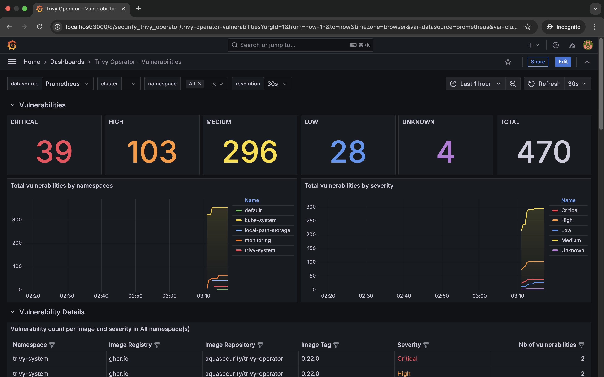
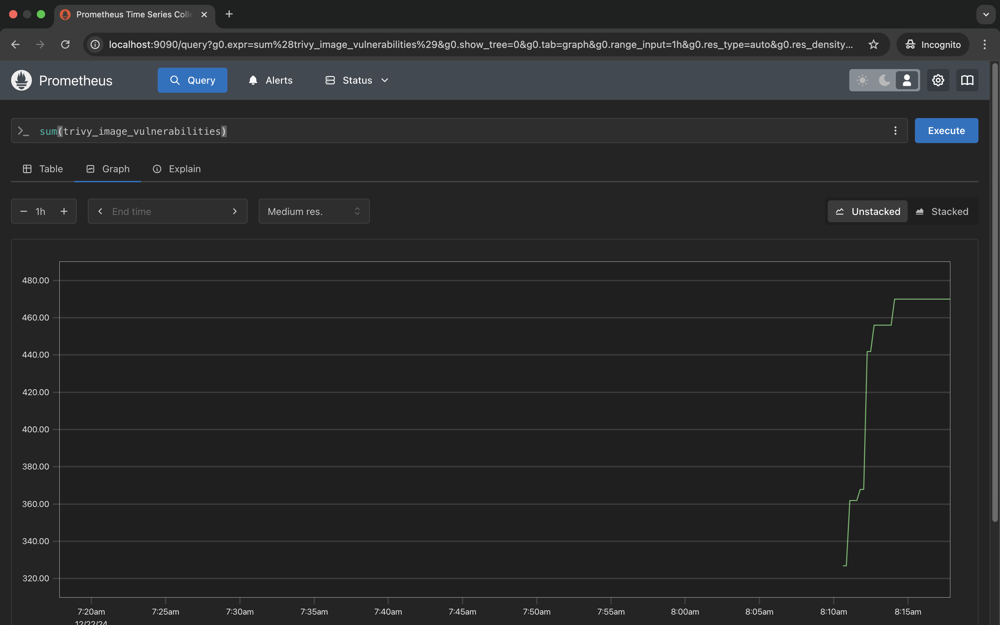

# Trivy Operator Grafana Dashboard

## Set Up a Kubernetes Cluster Using Kind

- Create a new Kubernetes cluster named `trivy-cluster`:

  ```bash
  kind create cluster --name trivy-cluster
  ```

- Ensure that your Kubernetes cluster is up and running:

  ```bash
  kubectl get nodes
  ```

  Expected output:

  ```
  NAME                           STATUS   ROLES    AGE   VERSION
  trivy-cluster-control-plane   Ready    control-plane   2m    v1.26.0
  ```

---

## **Deploy a Sample Application**

- Navigate to the folder with `nginx-deployment.yaml`:

  ```bash
  cd manifests
  ```
  
- Apply the deployment:

  ```bash
  kubectl apply -f nginx-deployment.yaml
  ```

- Verify the deployment:

  ```bash
  kubectl get pods
  ```

  Expected output:

  ```
  NAME                                READY   STATUS    RESTARTS   AGE
  nginx-deployment-xxxxxxxxxx-yyyyy   1/1     Running   0          1m
  ```

---

## Install Prometheus and Grafana

- Create monitoring namespace:

  ```bash
  kubectl create namespace monitoring
  ```

- Add Prometheus Helm repository:

  ```bash
  helm repo add prometheus-community https://prometheus-community.github.io/helm-charts
  ```

- Update Helm repositories:

  ```bash
  helm repo update
  ```

- Navigate to the folder with `prometheus-values.yaml` to customize the Prometheus installation. The current configuration enables the discovery of `ServiceMonitors` by Prometheus.

  ```bash
  cd manifests
  ```
  
- Use Helm to install the `kube-prometheus-stack` chart with the customized values:

  ```bash
  helm upgrade --install prom prometheus-community/kube-prometheus-stack \
    -n monitoring \
    --values prometheus-values.yaml
  ```

- To verify the installation, list the pods in the `monitoring` namespace:

  ```bash
  kubectl --namespace monitoring get pods -l "release=prom"
  ```

  Expected Output:

  ```
  NAME                                                 READY   STATUS    RESTARTS   AGE
  prom-alertmanager-prom-0                              2/2     Running   0          5m
  prom-grafana-xxxxxxxxxx-yyyyy                        1/1     Running   0          5m
  prom-kube-prometheus-stack-operator-xxxxxxxxxx-yyyyy  1/1     Running   0          5m
  prom-kube-prometheus-stack-prometheus-0              2/2     Running   0          5m
  ...
  ```

---

## Install Trivy Operator

- Add Aqua Security's Helm repository:

  ```bash
  helm repo add aqua https://aquasecurity.github.io/helm-charts/
  ```

- Update Helm repositories:

  ```bash
  helm repo update
  ```

- Navigate to the folder with `trivy-values.yaml` to customize the Trivy Operator installation. This configuration enables the `ServiceMonitor` and sets Trivy to ignore vulnerabilities without available fixes:

  ```bash
  cd manifests
  ```
  
- Use Helm to install the Trivy Operator with the customized values:

  ```bash
  helm install trivy-operator aqua/trivy-operator \
    --namespace trivy-system \
    --create-namespace \
    --version 0.24.0 \
    --values trivy-values.yaml
  ```

- To verify the installation, list the pods in the `trivy-system` namespace:

  ```bash
  kubectl --namespace trivy-system get pods
  ```

  Expected output:

  ```
  NAME                                READY   STATUS    RESTARTS   AGE
  trivy-operator-xxxxxxxxxx-yyyyy     1/1     Running   0          2m
  ```

---

## Access Prometheus and Grafana Dashboards

- Port-Forward Prometheus dashboard:

  ```bash
  kubectl port-forward service/prom-kube-prometheus-stack-prometheus -n monitoring 9090:9090
  ```

  Access Prometheus: open your browser and navigate to [http://localhost:9090](http://localhost:9090).

- Port-Forward Grafana dashboard:

  ```bash
  kubectl port-forward service/prom-grafana -n monitoring 3000:80
  ```

  Access Grafana: open your browser and navigate to [http://localhost:3000](http://localhost:3000).

  Login Credentials:

  - Username: `admin`
  - Password: `prom-operator`

  *Note:* The default password is `prom-operator` unless you have customized it during the Helm installation. If you've set a different password, use that instead.

---

## **Configure Grafana Dashboard for Trivy Operator**

- Access Grafana: navigate to [http://localhost:3000](http://localhost:3000) and log in with your credentials.
- Import Trivy Operator dashboard:
  - Navigate to `Dashboards` < `Browse`.
  - Click `New`, then `Import`.
  - Paste the ID of the Aqua Trivy Dashboard: `16337`
  - Select the data source you want, default if no other data sources.
  - Once pasted, you should see the following dashboard as part of your Dashboard list: `Trivy Operator - Vulnerabilities`



---

## **Verify Trivy Operator Metrics**

1. Port-Forward Trivy Operator Metrics (Optional)

   For demonstration purposes, you can port-forward the Trivy Operator service to view metrics directly.

   ```bash
   kubectl port-forward service/trivy-operator -n trivy-system 5000:80
   ```

   Once you open http://localhost:5000/metrics you should see all the metrics gathered from the operator. However, this is obviously not the prettiest way of looking at them. Thus, the next sections will show you how to query metrics through Prometheus and visualise them in Grafana.

2. Query Metrics in Prometheus

   - Access Prometheus: navigate to [http://localhost:9090](http://localhost:9090).

   - Check Target Status:

     - Click on **"Status"** in the left sidebar and select **"Targets"**.
     - Ensure that the **Trivy Operator** endpoint is **UP** and being scraped successfully.

   - Run Sample Queries:

     Navigate to the **"Graph"** tab and execute the following PromQL queries to visualize Trivy Operator metrics:

     - Total vulnerabilities found:

       ```promql
       sum(trivy_image_vulnerabilities)
       ```

     - Total misconfigurations identified:

       ```promql
       sum(trivy_resource_configaudits)
       ```

     - Exposed secrets discovered:

       ```promql
       sum(trivy_image_exposedsecrets)
       ```
   
   


---

## **Clean Up**

- Delete the deployment:

  ```bash
  kubectl delete -f nginx-deployment.yaml
  ```

- Uninstall the Trivy Operator:

  ```bash
  helm uninstall trivy-operator -n trivy-system
  ```

- Delete the namespace (if created):

  ```bash
  kubectl delete namespace trivy-system
  kubectl delete namespace monitoring
  ```

- Delete the Kind Kubernetes cluster:

  ```bash
  kind delete cluster --name trivy-cluster
  ```
